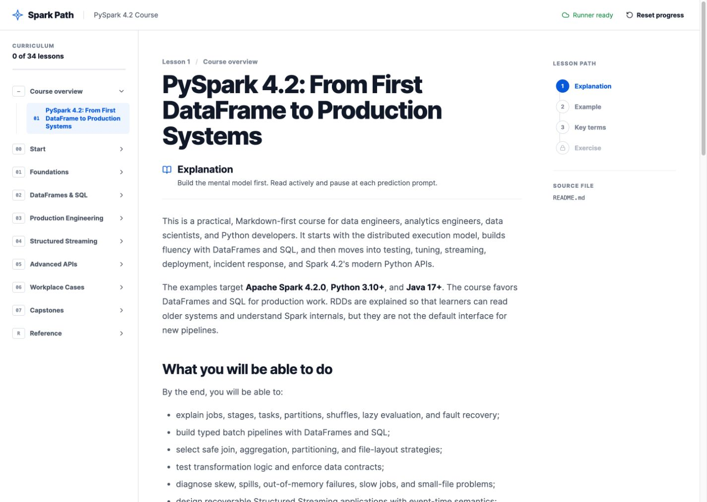
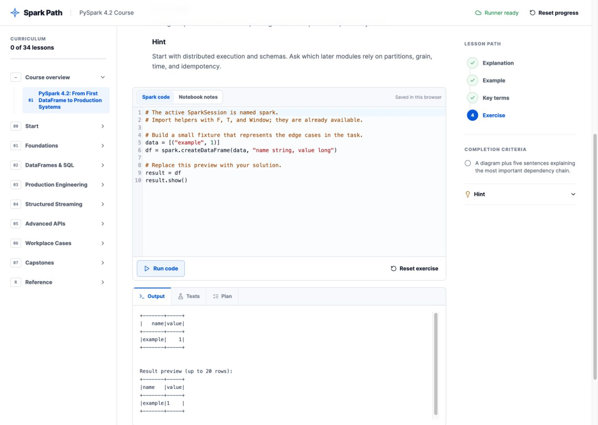
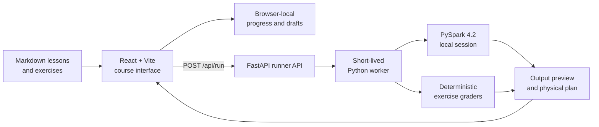

# Spark Path

An explanation-first, interactive PySpark 4.2 course for learning how to build, test, tune, and operate Spark workloads in realistic data-engineering environments.

<p align="center">
  <a href="https://spark.apache.org/docs/4.2.0/api/python/index.html"></a>
  
  
  
</p>

<p align="center">
  
</p>

Spark Path combines a Markdown-based curriculum with a browser learning environment and a real local PySpark runner. Learners progress through explanations, worked examples, definitions, and numbered exercises before running code, inspecting physical plans, or checking solutions against deterministic tests.

## Why Spark Path?

Many Spark tutorials teach individual API calls without teaching how distributed work behaves in production. Spark Path connects the syntax to the decisions data professionals make at work:

- reason about jobs, stages, tasks, partitions, shuffles, and lazy evaluation;
- define schemas, data contracts, grain, null behavior, and quality rules;
- design joins, aggregations, window calculations, and storage layouts safely;
- test transformation logic and build idempotent pipelines;
- diagnose skew, spills, memory pressure, small files, and slow jobs;
- design recoverable Structured Streaming applications;
- evaluate advanced APIs, including Arrow, pandas API on Spark, Spark Connect, Python data sources, MLlib, and declarative pipelines;
- produce operational artifacts such as runbooks, reconciliation evidence, architecture decisions, and incident reports.

## Course at a glance

| Area | Focus |
|---|---|
| Getting started | Environment setup, learning plan, and reproducibility |
| Foundations | Distributed execution, sessions, schemas, types, and RDD concepts |
| DataFrames and SQL | Transformations, windows, joins, storage, SQL, and catalogs |
| Production engineering | Design, testing, data quality, performance, observability, deployment, security, and cost |
| Structured Streaming | Execution model, event time, state, watermarks, joins, recovery, and operations |
| Advanced APIs | Arrow, pandas, Spark Connect, data sources, pipelines, and MLlib |
| Workplace cases | Batch ETL, CDC, fraud-stream design, and performance incidents |
| Capstones | Production-minded batch and streaming projects with review rubrics |

The repository currently contains:

- **34** ordered course and reference pages;
- **124** numbered exercises;
- **124** reference solutions with learner-controlled reveal;
- **9** fixture-based, automatically graded PySpark labs;
- batch, streaming, operational, and capstone assignments;
- a definition table on every course page.

Start with the [course overview](docs/README.md), or browse the complete [reference list](docs/reference/references.md).

## Learning workflow

Every lesson follows the same sequence:

1. **Explanation** — build the mental model and understand why the concept matters.
2. **Example** — trace inputs, transformations, actions, data movement, and output grain.
3. **Key terms** — review the definitions needed to communicate precisely.
4. **Exercise** — apply the lesson through code, analysis, or a workplace deliverable.
5. **Evidence** — run code, inspect output and plans, check tests, and record decisions.

The exercise workspace provides:

- a Python-aware code editor connected to an active local `SparkSession` for implementation exercises;
- Notebook notes that open by default and complete analysis, design, review, and documentation exercises as soon as the learner writes a response;
- optional notebook notes beside code exercises for assumptions, grain, and trade-offs;
- stdout and bounded DataFrame previews;
- formatted Spark physical plans;
- exercise-specific tests where an automatic grader is available;
- exercise-specific guided rubric checks for open-ended engineering and workplace tasks;
- an attempt requirement so a blank editor cannot pass a guided review;
- reference solutions that learners can reveal after attempting a task;
- separate completed/skipped progress, forward navigation, hints, and browser-local draft persistence.

<p align="center">
  
</p>

## Quick start

### Prerequisites

- Docker with Compose support;
- GNU Make;
- at least 3 GB of memory available to Docker.

Clone and start the complete course:

```bash
git clone https://github.com/felipe-cosse/spark-course.git
cd spark-course
make up
```

Open [http://localhost:8000](http://localhost:8000).

The first exercise execution may take several seconds while Spark creates its local session. Stop the foreground process with `Ctrl+C`, or run the course in the background instead:

```bash
make up-detached
make health
make down
```

If GNU Make is unavailable, use Docker Compose directly:

```bash
docker compose up --build
```

## Architecture



The Markdown files remain the source of truth. Vite imports them at build time, while FastAPI serves the production frontend and coordinates isolated worker processes for code execution.

## Project structure

```text
spark-course/
├── frontend/
│   ├── src/
│   │   ├── components/    Course reader and exercise interface
│   │   ├── data/          Curriculum order and graded-lab metadata
│   │   ├── hooks/         Local progress and draft persistence
│   │   └── lib/           Markdown parsing and runner client
│   └── tests/e2e/         Browser learning-flow tests
├── backend/
│   ├── app.py             FastAPI application and frontend serving
│   ├── runner.py          Worker lifecycle and timeout handling
│   ├── worker.py          Spark session, execution, and plan capture
│   ├── labs.py            Fixtures and deterministic graders
│   ├── content_check.py   Exercise/solution/definition coverage audit
│   └── solution_check.py  Executable published-solution verification
├── docs/
│   ├── exercises/         Companion exercise page for every lesson
│   ├── solutions/         Reference approaches for every numbered exercise
│   └── reference/         Glossary, cheat sheet, sources, troubleshooting
├── design/                Design specification, concepts, and screenshots
├── compose.yaml           Restricted local runtime configuration
├── Dockerfile             Multi-stage frontend and PySpark image
└── Makefile               Development, test, and runtime commands
```

## Development

### Frontend

Install dependencies and start Vite:

```bash
make install
make dev
```

The frontend runs at [http://localhost:5173](http://localhost:5173) and proxies `/api` requests to port `8000`.

### Backend

For local backend development, use Python 3.11 and Java 17:

```bash
python3.11 -m venv .venv
source .venv/bin/activate
pip install -r backend/requirements.txt
make dev-backend
```

Docker remains the recommended option when you want a reproducible Java and PySpark environment without modifying the host.

### Common commands

| Command | Purpose |
|---|---|
| `make help` | List available project commands |
| `make install` | Install locked frontend dependencies |
| `make dev` | Start the Vite development server |
| `make dev-backend` | Start FastAPI with reload enabled |
| `make test` | Run frontend unit tests |
| `make test-content` | Validate all exercise/solution/source/definition mappings |
| `make test-e2e` | Run browser learning-flow tests |
| `make test-solutions` | Build the image and run all 9 published graded answers in Spark |
| `make build` | Type-check and build the frontend |
| `make check` | Run unit tests, build, and browser tests |
| `make docker-build` | Build the complete course image |
| `make up-detached` | Build, start, and wait for a healthy container |
| `make logs` | Follow course and Spark runner logs |
| `make health` | Report API readiness and Spark version |
| `make down` | Stop and remove course containers |

## Writing or extending the course

Course content lives under `docs/` and can be reviewed without running the application. When adding a lesson:

1. Create the lesson Markdown file in the appropriate numbered module.
2. Include a `Key terms on this page` section with definitions.
3. Create its companion file under the matching `docs/exercises/` directory.
4. Add numbered exercises, deliverables or requirements, hints, and self-check questions.
5. Add one matching reference answer per exercise in `docs/solutions/reference-solutions.md`.
6. Register the lesson in `frontend/src/data/course.ts` to preserve the intended learning order.
7. Add a grader in `backend/labs.py` and metadata in `frontend/src/data/labs.ts` only when deterministic automatic checking is appropriate.
8. Run `make check` before opening a pull request.

When changing a graded lab, also run `make test-solutions`. This executes the first Python block published for each graded exercise against the same fixture and grader learners use, preventing a reference answer from drifting away from its prompt or checker.

## Testing and verification

Run the non-containerized checks:

```bash
make check
```

Verify the complete production image and runtime:

```bash
make docker-build
make up-detached
make health
```

Project verification covers Markdown and solution parsing, explanation-to-exercise gating, reference-solution reveal, rubric checking, skip navigation, browser persistence, frontend compilation, Docker assembly, API health, and real Spark execution paths.

`make check` also audits all 124 exercise mappings, verifies that every source page retains its definition section, and rejects missing, duplicate, placeholder, or unusually brief reference answers. `make test-solutions` is the slower Spark-level contract check for all automatically graded answers.

## Local runner safety

Submitted code runs in a short-lived process with restricted imports and a 35-second timeout. The Docker service also uses a read-only filesystem, a temporary execution directory, dropped Linux capabilities, process limits, and CPU/memory limits.

These controls are intended for a trusted learner running the course locally. **They are not a security boundary for executing arbitrary code from untrusted users.** A hosted or multi-user deployment would require stronger isolation, authentication, request limits, audit controls, and separate worker infrastructure.

## Contributing

Contributions that improve correctness, instructional clarity, accessibility, exercises, or real-world coverage are welcome.

1. Fork the repository and create a focused branch.
2. Keep course terminology and examples consistent with the existing module structure.
3. Update both the lesson and its companion exercise page when behavior changes.
4. Add or update tests for application changes.
5. Run `make check` and, when Docker-related files change, `make docker-build`.
6. Open a pull request describing the learner problem and how the change improves it.

For Spark behavior and API details, prefer the versioned [Apache PySpark 4.2.0 documentation](https://spark.apache.org/docs/4.2.0/api/python/index.html) and record additional sources in [the course references](docs/reference/references.md).

## License

This repository does not currently include an open-source license. Until one is added, standard copyright restrictions apply.
